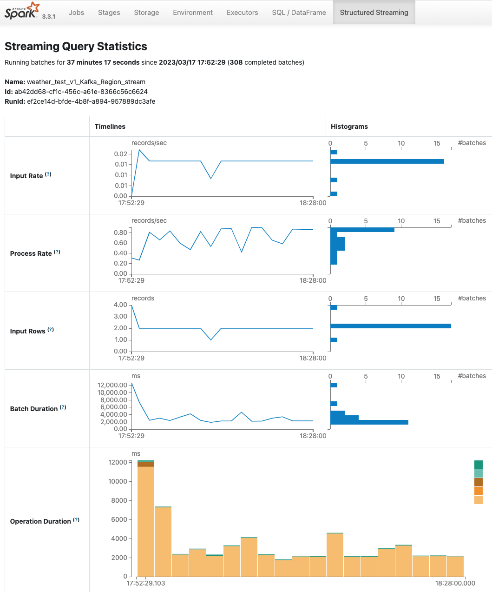

# Open Data Platform

- This repository holds a project built using open source tools such as Apache Kafka and Apache Spark.
- The goal of this project is to build an end to end data platform using open source tools and technologies.

### Pre-requisities:

- Docker

### Developer Details:

1. Create a docker network by running [intra_network.sh](intra_network/intra_network.sh) 
2. Create a docker volume by running [intra_storage.sh](intra_storage/intra_storage.sh)

3. Build spark image using [Docker file](spark_cluster/Dockerfile).
4. Build mysql image using [Docker file](spark_cluster/metastore/Dockerfile).
5. Build kafka image using [Docker file](kafka_cluster/Dockerfile).

6. Set the `USERNAME` environement in [run.sh](run.sh) and run the file to start the project.

---

### Open Data Platform Architecture

### Spark Cluster Architecture

---

### Screenshots

#### Kafka UI

---

#### Spark

---

#### Prometheus

---

####  Grafana

---

#### Superset

---

### Resources:
- [Docker Networking Tutorial](https://docs.docker.com/network/network-tutorial-standalone/#use-user-defined-bridge-networks)
- [apache spark docker file](https://github.com/apache/spark-docker/blob/master/3.3.1/scala2.12-java11-python3-ubuntu/Dockerfile)
- [Medium Article](https://towardsdatascience.com/apache-spark-cluster-on-docker-ft-a-juyterlab-interface-418383c95445)
- [Jupyter Spark image Documentation](https://jupyter-docker-stacks.readthedocs.io/en/latest/using/specifics.html#apache-spark)
- [Startup script Example](https://cloudinfrastructureservices.co.uk/create-apache-spark-docker-container-using-docker-compose/)
- [Kafka Advertised Listeners](https://rmoff.net/2018/08/02/kafka-listeners-explained/)
- [Spark Thrift Server](https://spark.apache.org/docs/latest/sql-distributed-sql-engine.html)
- [Spark Thrift Server Example](https://chenriang.me/connect-delta-lake-with-jdbc.html)